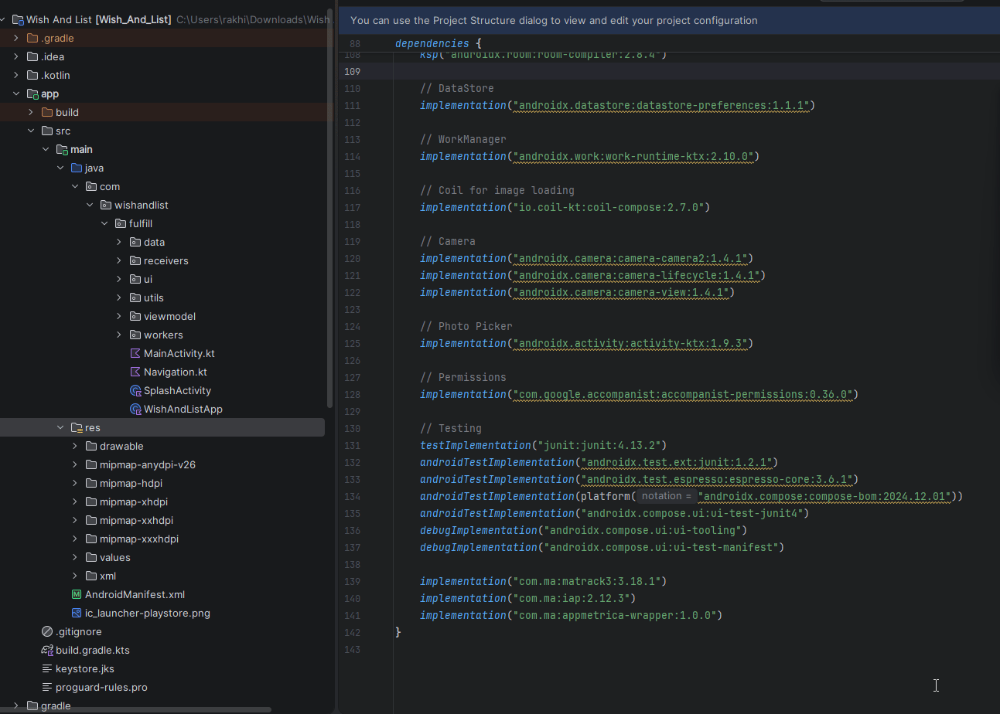

## 🖼️ Demo

# Localized Launcher Icon Plugin

An Android Studio plugin that simplifies the creation of localized launcher icons (`ic_launcher`, `ic_launcher_round`, `ic_launcher_foreground`, `ic_launcher_background`) with support for multiple screen densities and locale-specific folders.

## 🚀 Features

- Generates icons for all screen densities (`mdpi`, `hdpi`, `xhdpi`, `xxhdpi`, `xxxhdpi`)
- Supports locale-specific output directories (e.g., `mipmap-ru-xxhdpi`, `mipmap-ru-anydpi-v26`)
- Foreground and background image composition with customizable corner radius
- Perfect circle generation for round icons (`ic_launcher_round`)
- Easy-to-use UI with:
    - Icon name input
    - Locale code input (e.g., `ru`, `en-rUS` or list of locales by template (`es-rCL, es-rAR, es-rPE, qu-rPE`))
    - Foreground and background image pickers with preview
    - So easy to add appname for your chosen locales

## 🛠️ Installation

### 📦 From JetBrains Marketplace *(Recommended)*

> Coming soon...

### 🧾 From `.jar` File (Manual Installation)

1. Open **Android Studio** (or IntelliJ IDEA)
2. Go to **Settings / Preferences > Plugins**
3. Click the ⚙️ **gear icon**, then select **"Install Plugin from Disk..."**
4. Choose the `.jar` file you built or downloaded
5. Restart the IDE when prompted

## 🧪 How to Use

1. **If** you forked repository don\`t forget to update Android Studio local path in `build.gradle.kts`.
2. **Right-click on the `res` folder** → `New` → `Localized Launcher Icon`.
3. **Fill out the dialog form**:
    - Icon name (`ic_launcher`)
    - Locale code (`en`, `ru-rKZ` or list of locales by template (`es-rCL, es-rAR, es-rPE, qu-rPE`))
    - Select foreground and background images
    - Use checkbox to add appname for chosen locales
    - Input appname value
4. **Click OK** — all icons will be generated automatically.

P.S. don`t forget refresh all files from your disk to update project files in Android Studio

