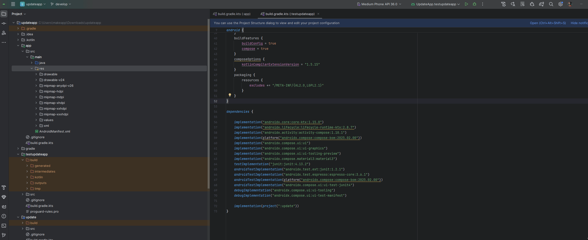

# Localized Launcher Icon Plugin

An Android Studio plugin that simplifies the creation of localized launcher icons (`ic_launcher`, `ic_launcher_round`, `ic_launcher_foreground`, `ic_launcher_background`) with support for multiple screen densities and locale-specific folders.

## 🚀 Features

- Generates icons for all screen densities (`mdpi`, `hdpi`, `xhdpi`, `xxhdpi`, `xxxhdpi`)
- Supports locale-specific output directories (e.g., `mipmap-ru-xxhdpi`, `mipmap-ru-anydpi-v26`)
- Foreground and background image composition with customizable corner radius
- Perfect circle generation for round icons (`ic_launcher_round`)
- Easy-to-use UI with:
    - Icon name input
    - Locale code input (e.g., `ru`, `en-rUS`)
    - Foreground and background image pickers with preview

## 🧪 How to Use

1. **Install the plugin** from `.jar` file or fork repository and run plugin in IntelliJ IDEA.
2. **If** you forked repository don\`t forget to update Android Studio local path in `build.gradle.kts`.
3. **Right-click on the `res` folder** → `New` → `Localized Launcher Icon`.
4. **Fill out the dialog form**:
    - Icon name (`ic_launcher`)
    - Locale code (`en`, `ru-rKZ`)
    - Select foreground and background images
5. **Click OK** — all icons will be generated automatically.

P.S. don`t forget refresh all files from your disk to update project files in Android Studio
## 🖼️ Demo

